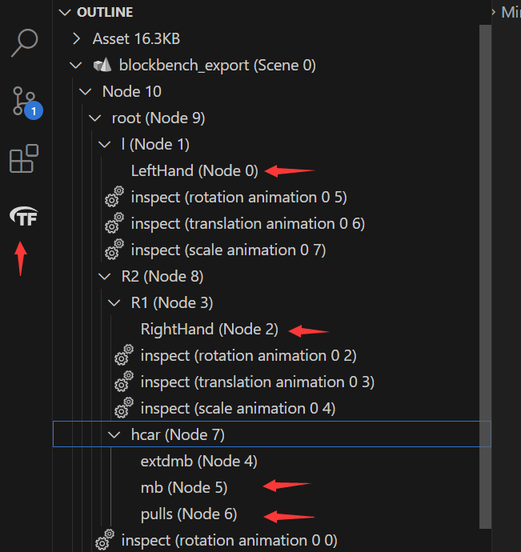

# 动画控制器
动画控制器负责加载动画模型文件和为实际渲染类提供某个模型实际的输出位置和角度以实现动画的播放。

添加一个新的动画控制器，你需要继承并实现`GunAnimationController`中的一系列抽象方法  

具体来说，你可以参考任意一个已经实现的动画控制器，一般情况下只需进行一些简单修改即可  

## 加载动画
`AnimationMeta`是动画的元数据，你需要为每个你需要加载的动画创建一个`AnimationMeta`对象并指定其路径，就像这样：
```java
    public static final AnimationMeta RELOAD_NORM = new AnimationMeta(new ResourceLocation(Reference.MOD_ID,"animations/hcar_reload_norm.gltf"));
    public static final AnimationMeta RELOAD_EMPTY = new AnimationMeta(new ResourceLocation(Reference.MOD_ID,"animations/hcar_reload_empty.gltf"));
    public static final AnimationMeta INSPECT = new AnimationMeta(new ResourceLocation(Reference.MOD_ID,"animations/hcar_inspect.gltf"));
    public static final AnimationMeta DRAW = new AnimationMeta(new ResourceLocation(Reference.MOD_ID,"animations/hcar_draw.gltf"));
    public static final AnimationMeta STATIC = new AnimationMeta(new ResourceLocation(Reference.MOD_ID,"animations/hcar_static.gltf"));
    private static final HCARAnimationController instance = new HCARAnimationController();
```
这里我们为`hcar`的每一个动画都创建了一个`AnimationMeta`静态字段，以便我们后续调用

然后，你需要在类构造器中加载这些动画并为枪械设置动画控制器  
```java
    private HCARAnimationController() {
        try {
            Animations.load(RELOAD_NORM);
            Animations.load(INSPECT);
            Animations.load(DRAW);
            Animations.load(RELOAD_EMPTY);
            Animations.load(STATIC);
        } catch (IOException e) {
            GunMod.LOGGER.fatal(e.getStackTrace());
        }
        this.enableStaticState();
        GunAnimationController.setAnimationControllerMap(ModItems.HCAR.getId(),  this);
    }
```

## 为动画部件指定node节点
如果你查看过TaC本体的`GunAnimationController`实现，你应该能发现里面有一系列的形如`INDEX_BODY`的静态字段，这些静态字段对应了`.gltf`文件中的`NODE`节点，一个比较方便的确认方法是安装一个`vscode`插件，比如 [glTF Tools](https://marketplace.visualstudio.com/items?itemName=cesium.gltf-vscode)

 

## 根据枪械状态返回到底要使用什么动画
完成动画的加载和设置后，我们还需要根据枪械的实际状态返回这个状态下到底要使用什么动画  
你需要实现`getAnimationFromLabel`方法，比如这样：
```java
    @Override
    public AnimationMeta getAnimationFromLabel(AnimationLabel label) {
        switch (label){
            case INSPECT: return INSPECT;
            case RELOAD_NORMAL: return RELOAD_NORM;
            case DRAW: return DRAW;
            case STATIC: return STATIC;
            case RELOAD_EMPTY: return RELOAD_EMPTY;
            default: return null;
        }
    }
```

## 完整的例子
```java
@OnlyIn(Dist.CLIENT)
public class HCARAnimationController extends GunAnimationController {
    public static int INDEX_BODY = 7;
    public static int INDEX_LEFT_HAND = 0;
    public static int INDEX_RIGHT_HAND = 2;
    public static int INDEX_MAG = 4;
    public static int INDEX_PULL = 6;

    public static final AnimationMeta RELOAD_NORM = new AnimationMeta(new ResourceLocation(Reference.MOD_ID,"animations/hcar_reload_norm.gltf"));
    public static final AnimationMeta RELOAD_EMPTY = new AnimationMeta(new ResourceLocation(Reference.MOD_ID,"animations/hcar_reload_empty.gltf"));
    public static final AnimationMeta INSPECT = new AnimationMeta(new ResourceLocation(Reference.MOD_ID,"animations/hcar_inspect.gltf"));
    public static final AnimationMeta DRAW = new AnimationMeta(new ResourceLocation(Reference.MOD_ID,"animations/hcar_draw.gltf"));
    public static final AnimationMeta STATIC = new AnimationMeta(new ResourceLocation(Reference.MOD_ID,"animations/hcar_static.gltf"));
    private static final HCARAnimationController instance = new HCARAnimationController();

    private HCARAnimationController() {
        try {
            Animations.load(RELOAD_NORM);
            Animations.load(INSPECT);
            Animations.load(DRAW);
            Animations.load(RELOAD_EMPTY);
            Animations.load(STATIC);
        } catch (IOException e) {
            GunMod.LOGGER.fatal(e.getStackTrace());
        }
        this.enableStaticState();
        GunAnimationController.setAnimationControllerMap(ModItems.HCAR.getId(),this);
    }

    public static HCARAnimationController getInstance(){
        return instance;
    }

    @Override
    public AnimationMeta getAnimationFromLabel(AnimationLabel label) {
        switch (label){
            case INSPECT: return INSPECT;
            case RELOAD_NORMAL: return RELOAD_NORM;
            case DRAW: return DRAW;
            case STATIC: return STATIC;
            case RELOAD_EMPTY: return RELOAD_EMPTY;
            default: return null;
        }
    }

    @Override
    public AnimationSoundMeta getSoundFromLabel(AnimationLabel label){
        return super.getSoundFromLabel(ModItems.HCAR.get(), label);
    }

    @Override
    protected int getAttachmentsNodeIndex() {
        return INDEX_BODY;
    }

    @Override
    protected int getRightHandNodeIndex() {
        return INDEX_RIGHT_HAND;
    }

    @Override
    protected int getLeftHandNodeIndex() {
        return INDEX_LEFT_HAND;
    }
}

```